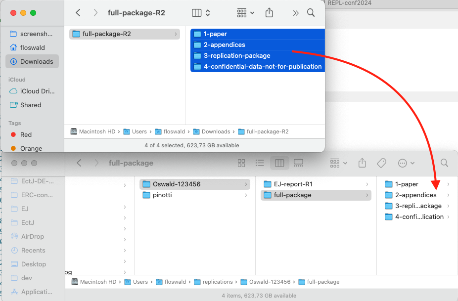

# RES Reproducibility Template Repository


> This repo is the template for reproducibility checks at the Royal Economic Society Journals.

## Steps to perform replication exercise

Suppose you are tasked to check package `Oswald-123456-R1`. You obtained an email from the Data Editor containing relevant information to access this package on a shared drive.

1. Download the [latest release of this repo](https://github.com/RES-Reproducibility/EJ-report-template/releases/latest) to your computer and unzip
1. download replication package from the provided [dropbox link](https://www.dropbox.com/scl/fi/ffh776z42tyz6pho5oqyn/full-package.zip?rlkey=mqqcpo22tiaf1zyjyib5d3z9l&st=a7i19dyh&dl=0) and unzip
1. create a *new directory* on your computer in a convenient location. For instance `~/replications/Oswald-123456`. Move _both unzipped_ folders there (this report template, and the unzipped replication package).
1. Optionally, initiate version control on the replication package to track changes (more below.)

In short, you want to end up with this structure once you are done setting up:

```bash
Oswald-123456/
├── EJ-report-R1
│   ├── EJ-report-template.Rproj
│   ├── EJ-report.docx
│   ├── EJ-report.odt
│   ├── EJ-report.qmd
│   ├── README.md  # you are actually looking at this file. :-)
│   ├── _quarto.yml
│   ├── _variables.yml
│   └── banner.png
└── full-package
    ├── 1-paper
    ├── 2-appendices
    ├── 3-replication-package
    │   ├── README.md
    │   ├── code  
    │   ├── data
    │   └── output
    └── 4-confidential-data-not-for-publication
        └── iris.csv
```

Here is a sequence of commands which should work on most unix/MacOS terminals.

```bash
cd  # start in your home directory
mkdir -p replications/Oswald-123456
cd replications/Oswald-123456
wget https://github.com/RES-Reproducibility/EJ-report-template/archive/refs/heads/main.zip
unzip main.zip
rm main.zip
mv EJ-report-template-main EJ-report-R1  # rename

# get the replication package from dropbox
curl -L -o oswalds-package.zip "https://www.dropbox.com/scl/fo/p3xtkyy4bj5s63i3iusoh/AKEFJt8qTRrl-g1t6_nEDio?rlkey=fp6hnw74n6ix9tz9cs1ef3luk&dl=1"

unzip oswalds-package.zip
rm oswalds-package.zip full-package.zip

cd full-package
unzip 3-replication-package.zip
unzip 4-confidential-data-not-for-publication.zip

rm 3-replication-package.zip
rm 4-confidential-data-not-for-publication.zip

ls 3-replication-package  # check it out

# optionally
cd 3-replication-package
git init

git add .  # track entire package with git
git commit -m 'version R1 code initial commit'
```


## Which Template to use?

> Remember to rename your report properly. Following our example, this would be `Oswald-123456-R1.qmd` or whatever format you choose. Don't send me a compiled `.pdf`!

**tl;dr**: Word and OpenOffice allow quick (drag and drop) inclusion of screenshots. Quarto requires you to send me a zip which contains any extra images.

* Always use the provided template (don't use any old template on your computer)
* If you want to use quarto (qmd), open the file in RStudio or VScode
* Edit text, tick boxes, insert errors as textual output in code boxes 
````
```
here the error message
or any other textual output
copy and paste from stata, matlab, R console etc is fine
```
````
* Save screenshots into the images folder `Oswald-123456/EJ-report-R1/img` (like for instance `banner.png`)
* include your screenshots in text via markdown syntax
```

```

## Subsequent Iterations

We want a quick and reliable way to see changes to both code and data. There is `git` and a GUI solution.


A simple GUI based solution is provided via [`KDiff3`](https://kdiff3.sourceforge.net/). This allows to compare the contents of two folders. You would copy the next iteration as `full-package-R2` into our working directory and then compare with `full-package` in `KDiff3`:

```bash
Oswald-123456/
├── EJ-report-R1
│   ├── EJ-report-template.Rproj
│   ├── EJ-report.docx
│   ├── EJ-report.odt
│   ├── EJ-report.qmd
│   ├── README.md  # you are actually looking at this file. :-)
│   ├── _quarto.yml
│   ├── _variables.yml
│   └── banner.png
└── full-package
    ├── 1-paper
    ├── 2-appendices
    ├── 3-replication-package
    │   ├── README.md
    │   ├── code  
    │   ├── data
    │   └── output
    └── 4-confidential-data-not-for-publication
        └── iris.csv
└── full-package-R2
    ├── 1-paper
    ├── 2-appendices
    ├── 3-replication-package
    │   ├── README.md
    │   ├── code  
    │   ├── data
    │   └── output
    └── 4-confidential-data-not-for-publication
        └── iris.csv
```

If **and only if** you initated git version control in the first iteration, you can just unzip the next iteration, and move its content into `full-package`. This will overwrite old content, but changes will be visible to git. This would look like here:



after that, you would be able to run `git diff` and see the following:

```
floswald@PTL11077 ~/r/O/f/3-replication-package (main)> git diff                                                                                   
diff --git a/code/Oswald.jl/src/Oswald.jl b/code/Oswald.jl/src/Oswald.jl
index 6f7ff36..06fec34 100644
--- a/code/Oswald.jl/src/Oswald.jl
+++ b/code/Oswald.jl/src/Oswald.jl
@@ -2,4 +2,7 @@ module Oswald
 
 greet() = print("Hello World!")
 
+"more serious work now"
+serious() = print("I am doing more serious work now.")
+
 end # module Oswald
```

## Tools

### How to deal with large data files?

We often get compressed data files. On MacOS `.zip` files larger than 4GB may cause trouble. I recommend

```
# mac terminal
brew update
brew install p7zip
# then
7za x 4-confidential-data-not-for-publication.zip
```

### Meta

one creates the `.docx` and `.odt` on the quarto command line with

```
quarto render EJ-report.qmd --to odt,html,docx
```
